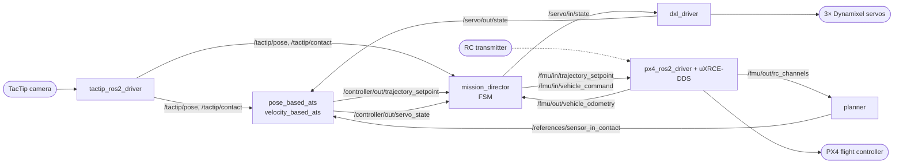

# Overview

## What the system does

The platform is an **unmanned aerial manipulator (UAM)**: a PX4 quadrotor with a 3-DOF serial arm. The end-effector is a **TacTip** optical tactile sensor.

A mission runs in three broad phases:

1. **Fly to the surface** — take off, hover, and approach the wall/object under PX4 offboard
   control.
2. **Make contact** — the TacTip detects contact (via image similarity to a reference image).
3. **Tactile servoing** — a controller closes the loop on the tactile pose, driving *both* the
   drone body and the arm joints so the sensor maintains a desired contact depth/orientation
   while sliding along the surface.

The whole sequence is orchestrated by a **mission director** — a finite state machine that also
enforces safety (arming, offboard checks, contact-loss handling, emergency stop).

## Nodes and data flow

Everything runs as ROS 2 (Humble) nodes on the onboard companion computer. The ROS2 graph looks like:

The tactile servoing controller publishes its computed setpoints to `/controller/out/*`, and the mission director *relays*
them to the flight controller and servos only while the FSM is in the `tactile_servoing` state.
In every other state the mission director issues its own setpoints (takeoff, hover, land). This
keeps all authority over the aircraft in one place.

## Package layout

The workspace root is `ros2_ws/`. Packages are grouped by role under `ros2_ws/src`:

### `core/` — the control stack
| Package | Role |
|---------|------|
| [`mission_director`](../ros2_ws/src/core/mission_director/README.md) | Flight state machine; orchestrates the mission and relays setpoints. One node per mission variant. |
| [`pose_based_ats`](../ros2_ws/src/core/pose_based_ats/README.md) | The tactile-servoing controllers (`velocity_based_ats`, `pose_based_ats`). |
| [`ats_planner`](../ros2_ws/src/core/ats_planner/README.md) | Publishes references for the tactile servoing controller. Allows reference manipulation through the RC. |
| [`manipulator_controller`](../ros2_ws/src/core/manipulator_controller/README.md) | Body-frame kinematic arm controller (end-effector position/velocity → joint states). |
| [`wrench_observer`](../ros2_ws/src/core/wrench_observer/README.md) | Estimates external wrench/torque from IMU and actuator data. |

### `drivers/` — hardware interfaces
| Package | Role |
|---------|------|
| [`tactip_ros2_driver`](../ros2_ws/src/drivers/tactip_ros2_driver/README.md) | Captures the tactile image, runs the pose-estimation model, detects contact. |
| `px4_msgs` | PX4 uORB message definitions (submodule). |
| [`dxl_driver`](../ros2_ws/src/drivers/dynamixel/dxl_driver/README.md) | Dynamixel servo driver (ROBOTIS SDK). |
| `dynamixel_sdk` | ROBOTIS DynamixelSDK (submodule). |

### `simulation/` — Gazebo model and sim-only nodes
| Package | Role |
|---------|------|
| [`px4_uam_sim`](../ros2_ws/src/simulation/px4_uam_sim/README.md) | Gazebo UAM world + URDF/xacro models. |
| [`sim_remapper`](../ros2_ws/src/simulation/sim_remapper/README.md) | Bridges `/servo/*` topics to per-joint Gazebo velocity commands. |
| [`keyboard_rc_emulator`](../ros2_ws/src/simulation/keyboard_rc_emulator/README.md) | Emulates the RC transmitter from the keyboard. |

### `ats_bringup/` — launch and configuration
[`ats_bringup`](../ros2_ws/src/ats_bringup/README.md) aggregates the launch files (one per
mission) and the parameter YAMLs. This is the package you `ros2 launch` from.

## Key topics

| Topic | Type | Produced by | Meaning |
|-------|------|-------------|---------|
| `/tactip/pose` | `geometry_msgs/TwistStamped` | tactip driver | Estimated contact pose (linear = shear x/y, depth z in mm; angular = surface orientation) |
| `/tactip/contact` | `std_msgs/Int8` | tactip driver | 1 if in contact, else 0 (from image SSIM) |
| `/references/sensor_in_contact` | `geometry_msgs/TwistStamped` | planner | Desired contact pose |
| `/controller/out/trajectory_setpoint` | `px4_msgs/TrajectorySetpoint` | controller | Drone velocity setpoint from the servoing law |
| `/controller/out/servo_state` | `sensor_msgs/JointState` | controller | Arm joint velocity references from the servoing law |
| `/md/state` | `std_msgs/Int32` | mission director | Current FSM state (numeric) |
| `/md/input` | `std_msgs/Int32` | operator | Manual state-transition trigger |
| `/servo/in/state` / `/servo/out/state` | `sensor_msgs/JointState` | MD / dxl driver | Arm joint command / feedback |
| `/fmu/in/*`, `/fmu/out/*` | `px4_msgs/*` | PX4 bridge | Flight-controller I/O (uXRCE-DDS) |

For the full picture of how the controller turns tactile error into setpoints, see
[System architecture](03-system-architecture.md).
